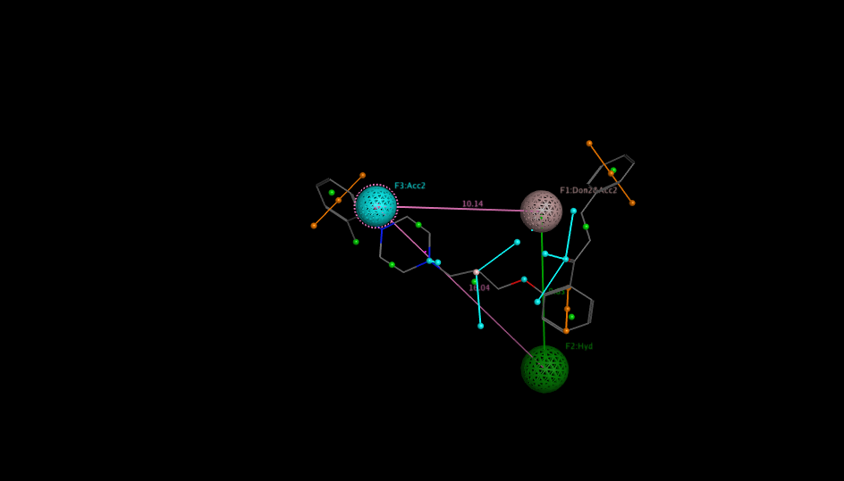
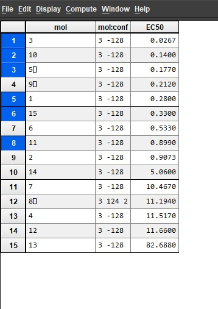
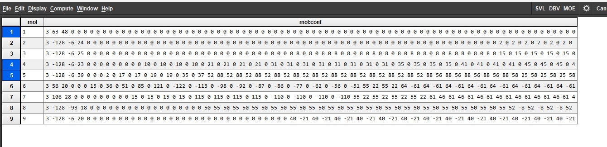

# 🧬 Pharmacophore Modeling for hERG Inhibitors

Welcome! This repository contains a step-by-step computational drug design activity where we developed **Pharmacophore models** to evaluate the **hERG liability** of various small molecule inhibitors. This project is ideal for beginners in **bioinformatics, cheminformatics, and drug discovery** who want a hands-on introduction to modeling using **MOE (Molecular Operating Environment)**.

---

## 🧠 Project Purpose

This was developed as a **class activity** for the Computational Drug Design course during my MS Bioinformatics at NUST. The main goal was to:
- Learn how to build, visualize, and evaluate pharmacophore models.
- Apply real-world screening techniques to predict the hERG risk of novel compounds.
- Practice using tools like MOE and managing scientific workflows.

---

## 🔧 Tools & Technologies Used

- 🧪 **MOE (Molecular Operating Environment)** – Pharmacophore building & screening
- 📁 **.mdb/.ph4** data formats – Used for molecular databases and models
- 🧬 **hERG inhibitor dataset** – Provided as a part of the coursework
- 🖼️ **Graphical outputs** – Screenshots and images for model and result visualization

---

## 📋 Summary of the Workflow

### 🧱 Step 1: Conformer Database Creation
- Import structures, pack conformations, and merge activity data.

### 🧪 Step 2: Pharmacophore Model Development
- Choose template compounds and define features.
- Search conformation databases to test model coverage.

### 📊 Step 3: Model Evaluation
- Rank conformations by similarity and quality (rmsd, mseq).
- Select optimal models based on accuracy and predicted binding.

### 🔍 Step 4: Prediction
- Screen unknown data and evaluate potential hERG liability.
- Interpret results using visual analysis and measured distances.

---

## 📸 Screenshots & Visuals

| Model Features | Pharmacophore Hit | hits in screening |
|--------------|-------------------|-----------------|
|  |  |  |

---

## 📦 Folder Contents

| File/Folder | Description |
|-------------|-------------|
| `Hazrat_maghaz.ph4` | Final pharmacophore model |
| `*.mdb` files | MOE molecular database files |
| `hazrat_maghaz.png` | Screenshot of model features |
| `details.txt` | Model Performence |

---

## 🤝 Contact Me

If you're a student, researcher, or enthusiast who wants to learn or contribute, feel free to reach out!

I’d be happy to help you get started with MOE or Pharmacophore modeling.

---

## 📜 License

This project is shared under the **MIT License**. You are free to use, modify, and share it — just give proper credit.

---

## 🙌 Acknowledgements

- Prof. Ishrat Jabeen – Course Instructor
- Computational Drug Design Lab – NUST

---

